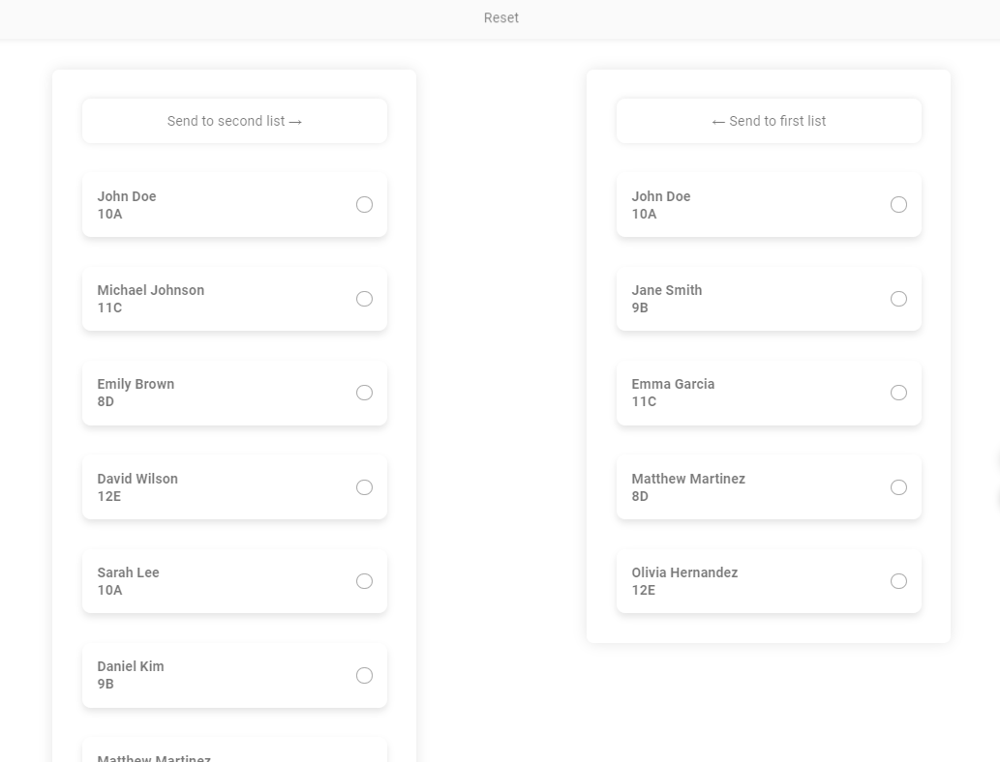
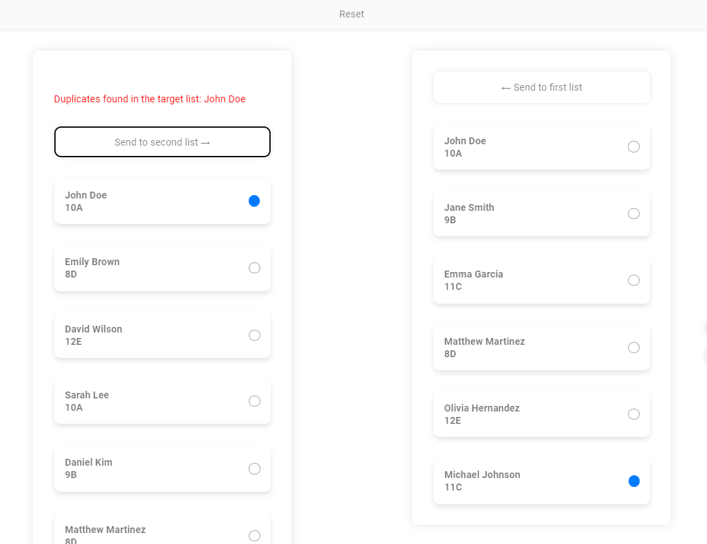

# Student List Manager

Student List Manager is a simple application built with Next.js for managing student lists. It allows users to transfer students between two lists, select and deselect students, and reset the application to its default state.

## Design

The design of the application follows a Glassmorphism UI concept, featuring transparent and blurred elements for a modern and sleek look. The student cards and buttons have a glass-like appearance, with soft shadows and rounded corners.

## Logic

The application logic revolves around managing two lists of students. Users can select and deselect students by clicking on their cards. They can also transfer students between the two lists with the provided buttons. The application prevents duplicates when transferring students and provides feedback to users when errors occur, such as duplicate entries.

## Tech Stack

- **Next.js**: React framework for building server-side rendered and static web applications.
- **TypeScript**: Provides static typing to JavaScript for enhanced code quality and development experience.
- **Styled Components**: Library for styling React components with scoped and dynamic CSS.
- **Zustand**: State management library for React applications, used for managing application state.

## How to Use

### Prerequisites

Make sure you have Node.js and npm installed on your machine.

### Installation

1. Clone the repository:

```

git clone <repository_url>

```

2. Navigate to the project directory:

`cd student-list-manager`

3. Install dependencies:

`npm install`

### Running the Application

To run the application in development mode:

`npm run dev`

The application will be available at [http://localhost:3000](http://localhost:3000).

### Testing the Application

1. Open your browser and navigate to [http://localhost:3000](http://localhost:3000).
2. You will see two lists of students. You can click on a student card to select or deselect them. Use the buttons provided to transfer students between the lists.
3. To reset the application to its default state, click on the "Reset" button.

## Screenshots

_Screenshot 1: Main Interface_


_Screenshot 2: Transfer Students_


## License

This project is licensed under the MIT License -
